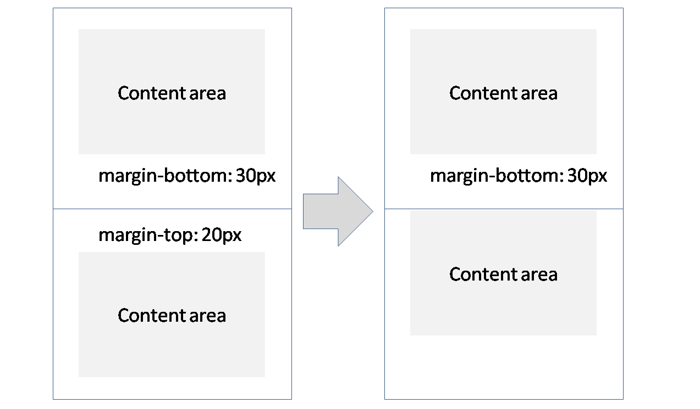
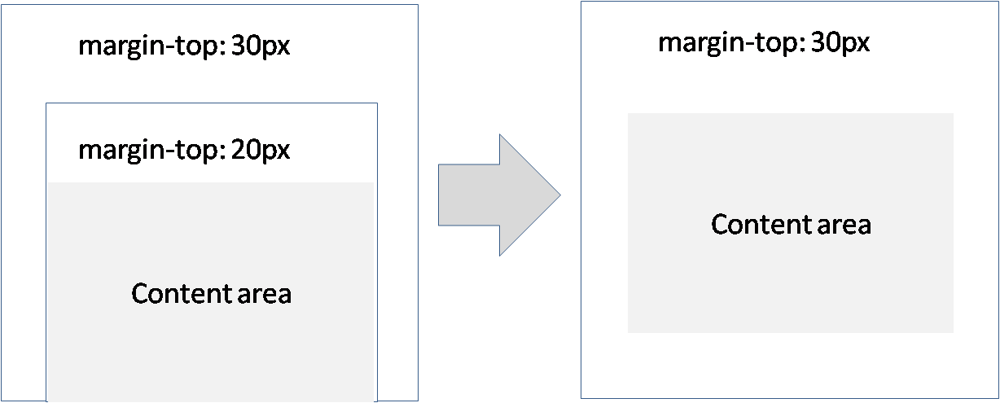

# Origin
There has been a lot of discussion about the fact that HTML wasn't designed for web apps. HTML provides two general purpose primitive tags `div` and `span` and then a *whole lot of CSS* to style and layout this and other tags to your hearts content. But lets take a step back and imagine how a framework *desgined for application layouts* would look like.

Here's how this book will do it:

## Not another CSS details book
This book isn't about making you awesome at passing the next CSS interview. This book is focused on arming you with the tools that will allow you to create great maintainable applications. This also means that if some CSS property is unintuitive (or unmaintainable at scale) it will not be covered.

## Reusing ideas of the past
XAML was a technology designed for layout. However there is nothing about HTML that prevents us from using the lessons there and using them to create a reliable layout system for the web.

# Fundamental concepts
There is very little fundamental knowledge you need. You really only need to know the difference between `margin` (something that's outside) and `padding` (something that is inside). Here's a picture:


## Margin is the enemy
One more thing about margin : *it collapses*. This means that if two items are next to each other with a margin of `30px` and `20px`, instead of of being separated by `50px` they will be separated by `30px`. This shown below:



Not only that, if an element is unfortunate to be at the border of its parent, its margin will collapse with its parent. These facts are shown below:



This makes it very difficult to create a maintainable layout system with margins. [](TODO: We will use them *but never in a container that has padding less than the child's margin*. More on this later.)

# Basic Setup
There are very few simple things about the default layout of an HTML page that need to be setup in order to prepare it for the application era:

* Full Sized Body
* Box Model

## Full Sized Body
You really want the root of your page to be something that takes up all the available space on screen and provides it as a drawing canvas for children. This can be done easily:

```css
html, body {
    height: 100%;
    width: 100%;
    padding: 0px;
    margin: 0px;
}
```

## Box Model
You really want the `width`/`height` of an element to represent the `border+padding+content`. This is shown below:


It sounds something basic but the first HTML spec got wrong. Its easy to fix though:

```css
html {
  box-sizing: border-box;
}
*, *:before, *:after {
  box-sizing: inherit;
}
```

# Rethinking the primitives
WIP If one was creating something for HTML today for application layout you would need a
